# 🏦 Banking Credit Risk Analysis using Python
## 📊 Project Snapshot

**Domain:** Banking Analytics

**Objective:** Assess customer credit risk using customer financial behavior.

**Tools:** Python • Pandas • NumPy • Matplotlib • Seaborn • SciPy

**Techniques:** Data Cleaning • Feature Engineering • EDA • Statistical Testing • Rule-Based Risk Scoring

**Outcome:** Built an explainable credit risk scoring system and generated business recommendations for lending decisions.
## 📌 Overview

Credit risk assessment is a critical process for financial institutions to minimize loan defaults and make informed lending decisions. This project analyzes customer banking and financial data using Python to identify key factors influencing creditworthiness through data cleaning, feature engineering, exploratory data analysis (EDA), statistical hypothesis testing, and a rule-based credit risk scoring system.

The project combines data analytics and statistical techniques to generate actionable business insights that can support data-driven lending strategies and customer risk assessment.
## 📈 Key Highlights

- ✔ 27 financial variables analyzed
- ✔ 15+ visualizations created
- ✔ 3 engineered financial features
- ✔ Statistical hypothesis testing performed
- ✔ Explainable rule-based credit risk model developed


---

## 🎯 Objectives

- Clean and preprocess banking customer data.
- Handle missing values and remove outliers.
- Perform feature engineering to derive meaningful financial metrics.
- Conduct Exploratory Data Analysis (EDA).
- Validate analytical findings using statistical hypothesis testing.
- Develop a rule-based credit risk scoring system.
- Validate the effectiveness of the proposed risk scoring model.
- Generate business recommendations for better credit risk management.

---

## 📂 Dataset

The dataset contains customer banking and financial information, including:

- Customer Age
- Occupation
- Annual Income
- Monthly In-hand Salary
- Number of Bank Accounts
- Number of Credit Cards
- Number of Loans
- Outstanding Debt
- Credit Utilization Ratio
- Interest Rate
- Monthly EMI
- Credit History Age
- Number of Delayed Payments
- Number of Credit Inquiries
- Payment Behaviour
- Payment of Minimum Amount
- Credit Score

---

## 🛠️ Tools & Technologies

- Python
- Pandas
- NumPy
- Matplotlib
- Seaborn
- SciPy
- Jupyter Notebook

---

## ⚙️ Project Workflow

### 1. Data Collection & Understanding
- Imported the dataset
- Explored dataset structure
- Checked data types
- Generated descriptive statistics
- Identified duplicate records
- Analyzed missing values

### 2. Data Cleaning & Preprocessing
- Handled missing values
- Removed duplicate records
- Corrected inconsistent data
- Converted data types
- Removed outliers using the IQR method

### 3. Feature Engineering
Created meaningful features including:

- Income per Account
- Debt-to-Income Ratio
- EMI Burden Ratio

### 4. Exploratory Data Analysis (EDA)

Performed comprehensive analysis on:

- Customer Age Distribution
- Occupation Distribution
- Annual Income Analysis
- Monthly Salary Analysis
- Debt-to-Income Ratio
- Credit Utilization Ratio
- Outstanding Debt
- Number of Bank Accounts
- Number of Credit Cards
- Number of Loans
- Interest Rate Distribution
- EMI Burden Analysis
- Credit History Analysis
- Delayed Payment Analysis
- Credit Inquiry Analysis
- Payment Behaviour
- Payment of Minimum Amount
- Credit Score Distribution
- Correlation Analysis

---

## 📊 Data Visualizations

The project includes multiple visualizations, including:

- Customer Age Distribution
- Occupation-wise Customer Distribution
- Occupation-wise Average Income
- Annual Income Distribution
- Monthly Salary vs Credit Score
- Credit Utilization Scatter Plot
- Loan Count vs Credit Score
- Delayed Payments vs Credit Score
- Delay from Due Date Distribution
- Correlation Heatmap
- Payment Behaviour Analysis
- Payment of Minimum Amount vs Credit Score
- Credit Score Distribution
- Good vs Poor Credit Score Comparison

---

## 📈 Statistical Hypothesis Testing

To validate analytical findings beyond visual exploration, statistical hypothesis testing was performed.

### Independent t-test

Used to compare numerical variables across different credit score groups.

Examples include:

- Annual Income
- Delayed Payments
- Credit Utilization Ratio
- Debt-to-Income Ratio
- EMI Burden

### Chi-Square Test

Used to determine relationships between categorical variables and customer credit score.

Examples include:

- Payment Behaviour
- Payment of Minimum Amount
- Credit Score Category

Only statistically significant relationships were considered while drawing business conclusions.

---

## ⚠️ Rule-Based Credit Risk Scoring

A transparent and interpretable rule-based credit risk scoring system was developed to classify customers according to their financial risk.

The scoring model considers multiple customer financial indicators, including:

- Delayed Payments
- Credit Utilization Ratio
- Outstanding Debt
- Debt-to-Income Ratio
- EMI Burden
- Payment Behaviour
- Payment of Minimum Amount
- Credit History

Customers are classified into:

- 🟢 Low Risk
- 🟡 Medium Risk
- 🔴 High Risk

---

## ✅ Risk Score Validation

The developed rule-based risk scoring model was validated against the actual customer credit scores.

Validation demonstrated that:

- High-risk customers predominantly belonged to the Poor Credit Score category.
- Low-risk customers were primarily associated with Good Credit Scores.
- The proposed scoring logic effectively identifies high-risk customers without relying on machine learning algorithms.

---

## 💡 Key Business Insights

- Customers with higher credit utilization generally exhibit lower credit scores.
- Frequent delayed payments significantly increase customer credit risk.
- Outstanding debt and EMI burden strongly influence creditworthiness.
- Longer credit histories are generally associated with better credit profiles.
- Income alone is not a reliable predictor of creditworthiness.
- Payment behaviour and repayment discipline are stronger indicators of customer financial health.
- Statistical hypothesis testing validated several key relationships identified during exploratory analysis.
- The rule-based risk scoring system provides an explainable approach for identifying high-risk customers.

---

## 📋 Business Recommendations

Based on the analytical findings, the following recommendations can improve lending decisions:

- Prioritize repayment behaviour over income while evaluating loan applicants.
- Flag customers with consistently high credit utilization for additional review.
- Monitor customers with frequent delayed payments as potential high-risk borrowers.
- Use the rule-based risk score as an initial screening mechanism before loan approval.
- Continuously monitor debt-to-income ratio and EMI burden for existing customers.
- Offer premium financial products to customers classified as Low Risk.

## 💼 Business Impact

This project demonstrates how data analytics can support better lending decisions by:

- Identifying high-risk customers early
- Supporting explainable credit risk assessment
- Reducing potential loan defaults
- Helping financial institutions improve customer screening

---

## 🏆 Key Results

- Cleaned and preprocessed customer banking data.
- Performed comprehensive Exploratory Data Analysis (EDA).
- Engineered meaningful financial features.
- Conducted statistical hypothesis testing to validate analytical findings.
- Developed a transparent rule-based credit risk scoring system.
- Validated the effectiveness of the proposed risk scoring model.
- Generated actionable business recommendations for credit risk management.

---

## 📁 Repository Structure

```text
Banking-Credit-Risk-Analysis/
│
├── Banking_Credit_Risk_Analysis.ipynb
├── README.md
├── requirements.txt
└── images/
    ├── customer_distribution_by_occupation.png
    ├── customer_age_distribution.png
    ├── annual_income_distribution_by_occupation.png
    ├── customer_annual_income_distribution.png
    ├── monthly_in_hand_salary_by_credit_score.png
    └── ...

---

## 🚀 Future Improvements

- Build machine learning models such as Logistic Regression, Decision Trees, and Random Forest for credit risk prediction.
- Compare machine learning models with the rule-based scoring approach.
- Develop an interactive Power BI dashboard for business users.
- Deploy the project using Streamlit for real-time customer risk assessment.
- Automate the end-to-end data preprocessing and scoring pipeline.

---

## 📌 Conclusion

This project demonstrates an end-to-end data analytics workflow for banking credit risk assessment. Starting from data cleaning and preprocessing, the analysis progressed through feature engineering, exploratory data analysis, statistical hypothesis testing, and the development of a rule-based credit risk scoring system.

The findings indicate that repayment behaviour, delayed payments, credit utilization, outstanding debt, and EMI burden are stronger indicators of customer creditworthiness than income alone. The validated risk scoring framework provides an explainable and practical approach for identifying high-risk customers, enabling financial institutions to make more informed lending decisions and strengthen risk management strategies.

---
## 👩‍💻 Author

**Rebekah Dhone**

- GitHub: https://github.com/rebekahdhone1-prog

# 📊 Visualizations

Below are the key visualizations generated during the exploratory data analysis (EDA), highlighting customer demographics, financial behavior, and factors influencing credit risk.

## 1. Customer Distribution by Occupation

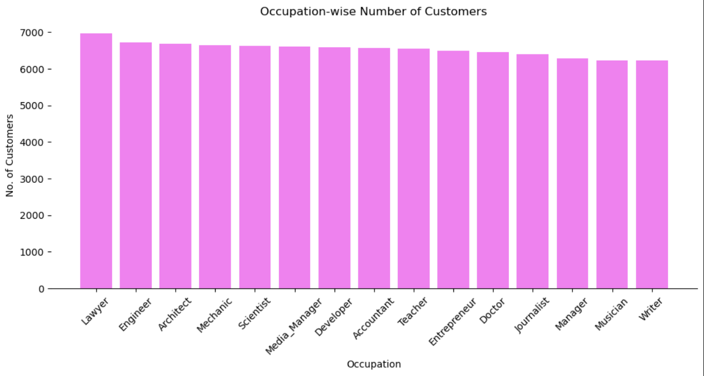

---

## 2. Customer Age Distribution

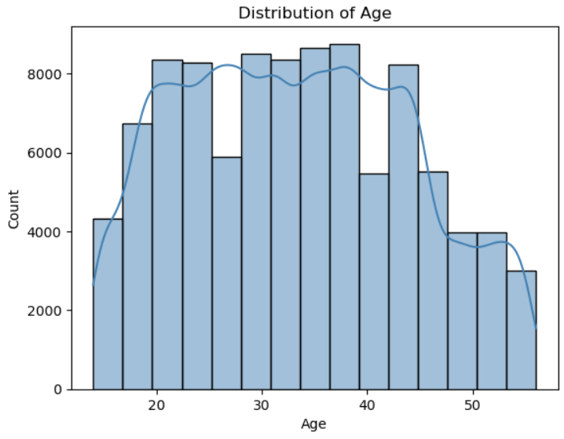

---

## 3. Annual Income Distribution Across Occupations

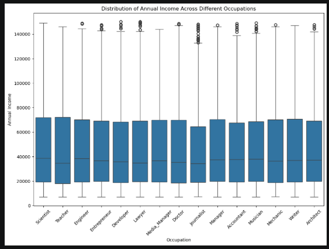

---

## 4. Customer Annual Income Distribution

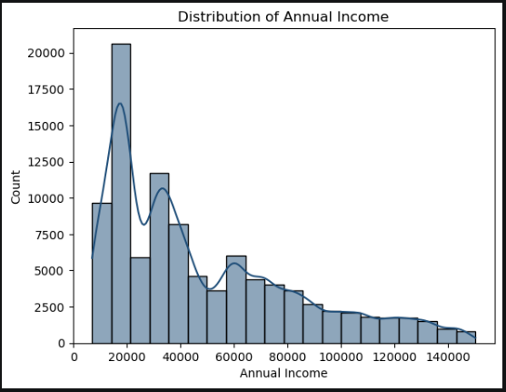

---

## 5. Monthly In-Hand Salary by Credit Score Category

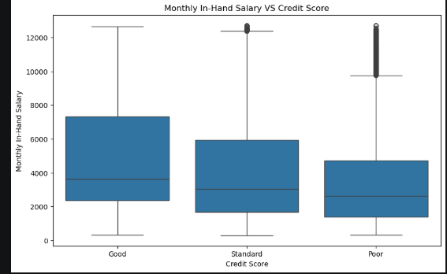

---

## 6. Annual Income Distribution by Credit Score Category

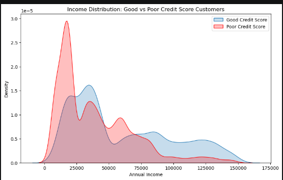

---

## 7. Average Number of Loans by Credit Score Category

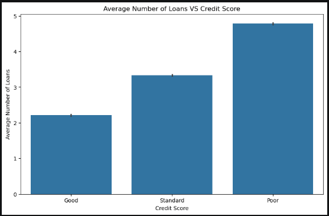

---

## 8. Outstanding Debt vs Annual Income by Credit Score

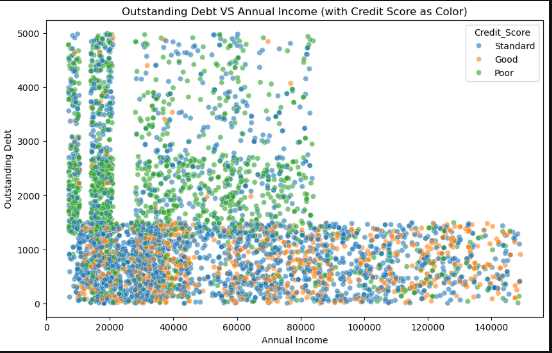

---

## 9. Number of Delayed Payments by Credit Score Category

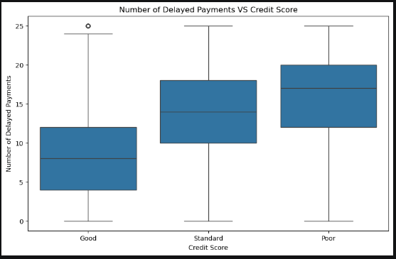

---

## 10. Distribution of Payment Delays

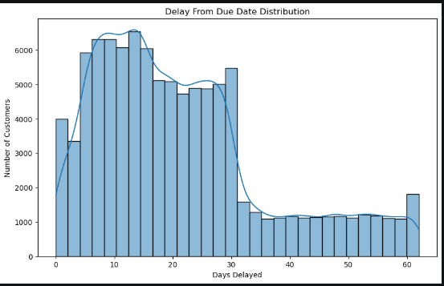

---

## 11. Correlation Heatmap of Financial Features

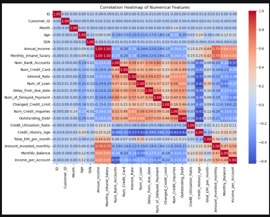

---

## 12. Minimum Payment Status by Credit Score Category

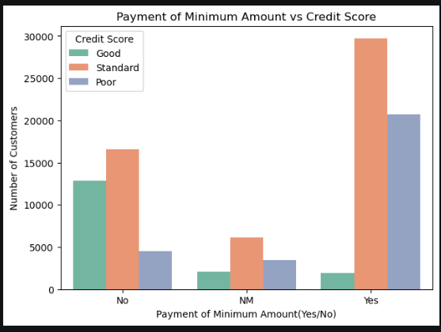

---

## 13. Customer Distribution by Credit Score Category

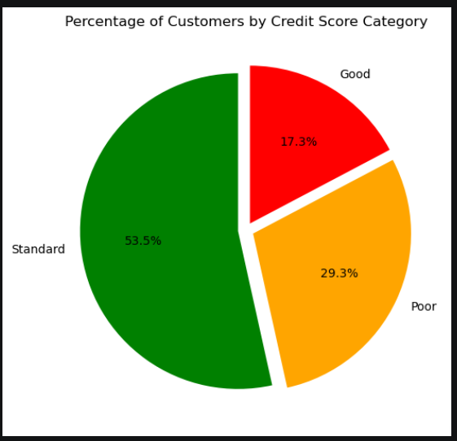
